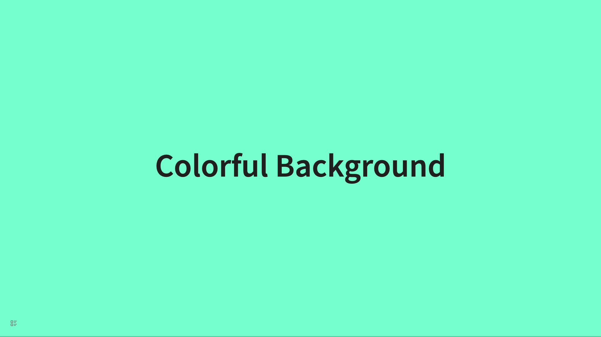
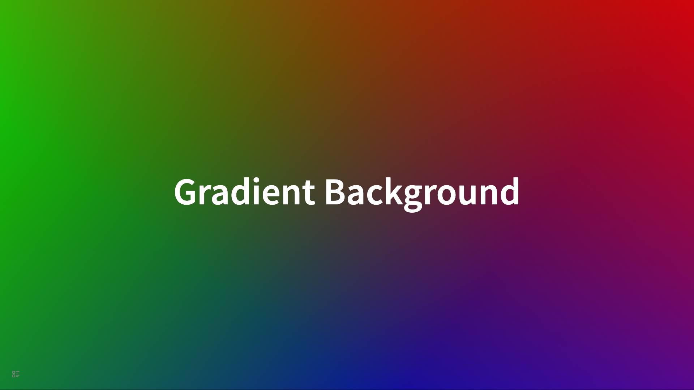
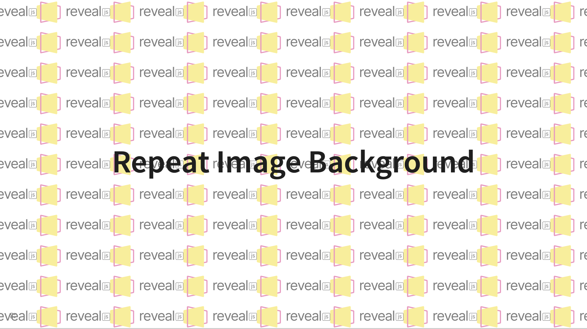
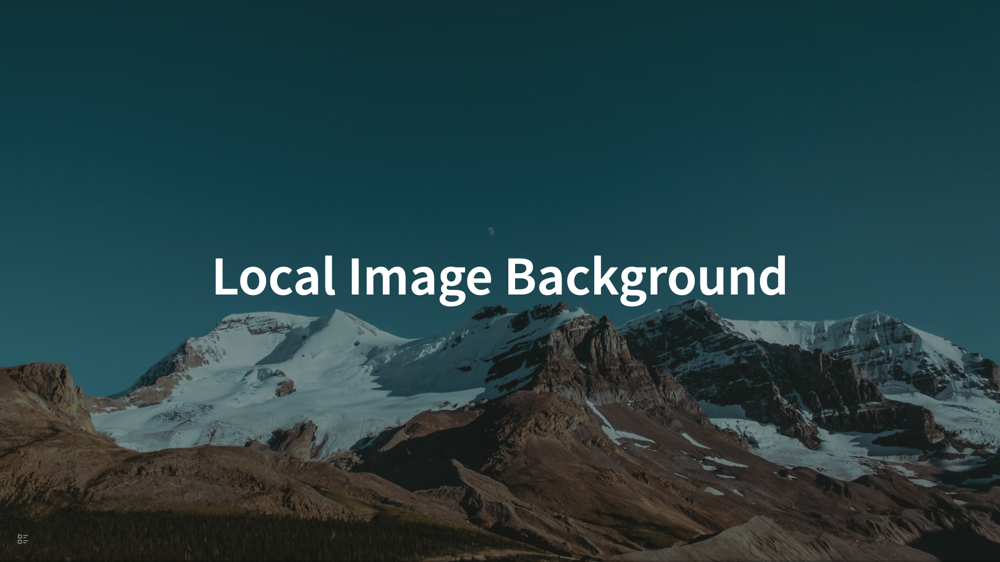
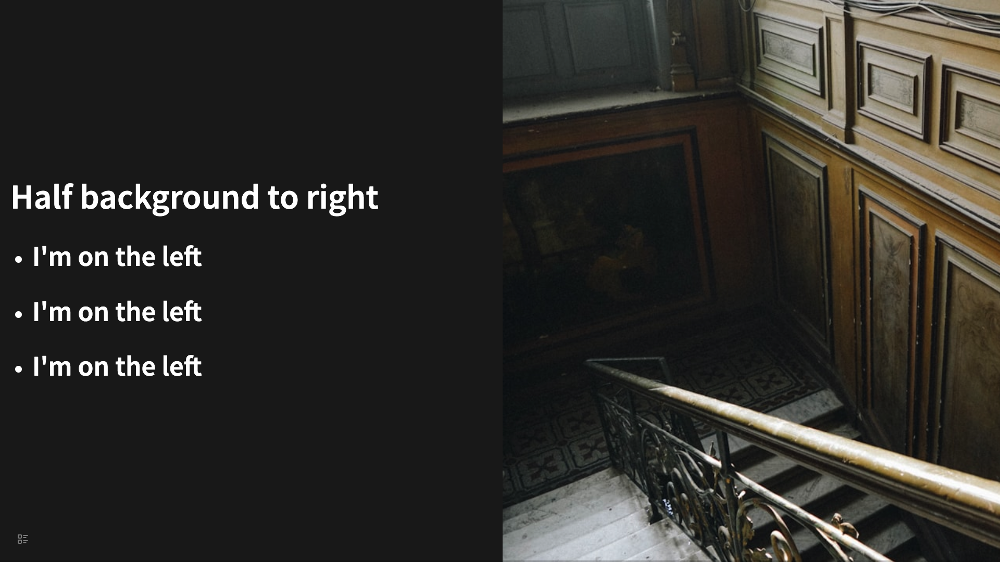
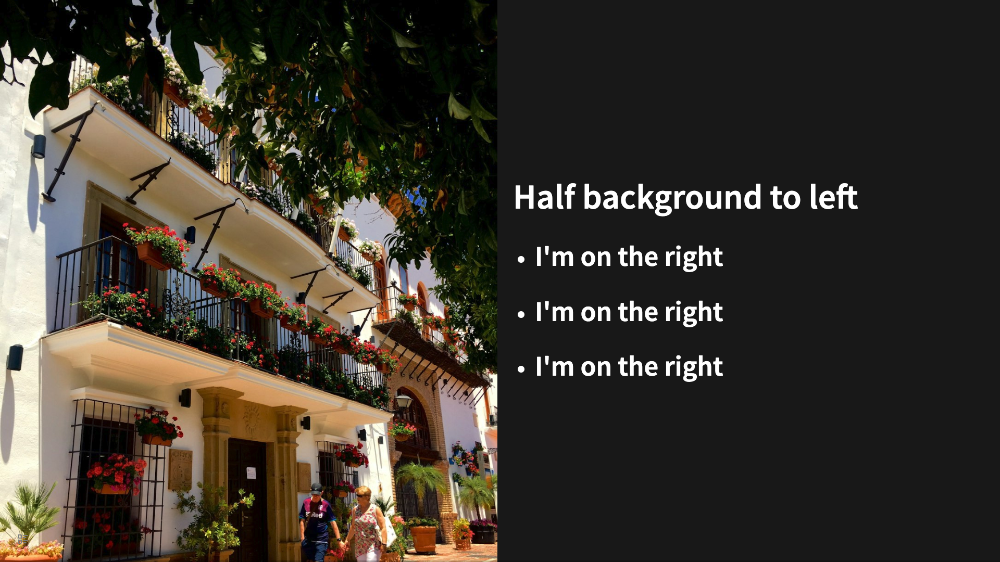
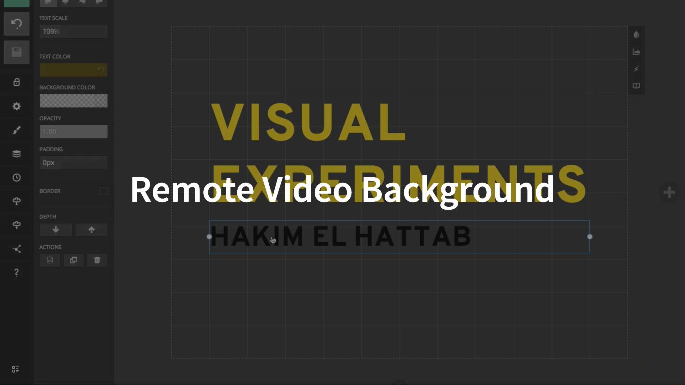
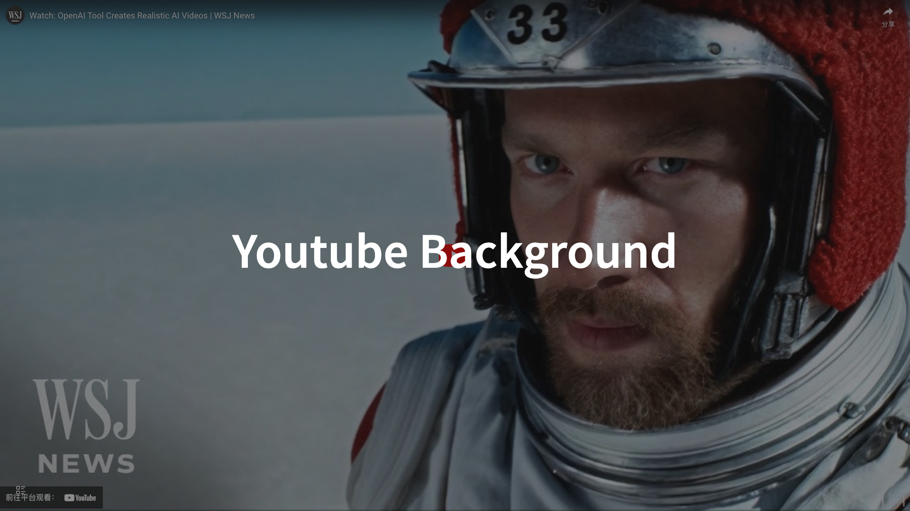

# 背景

## 带颜色的背景

```
- # Colorful Background
  data-background-color:: aquamarine
  data-transition:: convex
```



## 带渐变的背景

```
- # Gradient Background
  data-background-gradient:: linear-gradient(217deg, rgba(255,0,0,.8), rgba(255,0,0,0) 70.71%), linear-gradient(127deg, rgba(0,255,0,.8), rgba(0,255,0,0) 70.71%), linear-gradient(336deg, rgba(0,0,255,.8), rgba(0,0,255,0) 70.71%)
```



## 带远程图片的背景

```
- # Image Background
  data-background-image:: https://source.unsplash.com/random?1
  data-background-opacity:: 0.5
```


## 重复图片背景

```
- # Repeat Image Background
  data-background-image:: `https://revealjs.com/images/logo/reveal-black-text.svg`
  data-background-color:: white
  data-background-size:: 240px 100px
  data-background-repeat:: repeat
  data-background-opacity:: 0.5
```



## 带本地图片的背景

```
- # Local Image Background
  data-background-image:: ../assets/BA1yLjNnQCI1yisIZGEi_2013-07-16_1922_IMG_9873_1711730128767_0.jpg
  data-background-opacity:: 0.5

```



## 半屏背景在右

```
- ## Half background to right
  data-list:: true
  data-half-background-to:: right
  data-half-background-image:: https://source.unsplash.com/random?2
	- ### I'm on the left
	- ### I'm on the left
	  collapsed:: true
	- ### I'm on the left
```



## 半屏背景在左

```
- ## Half background to left
  data-list:: true
  data-half-background-to:: left
  data-half-background-image:: https://source.unsplash.com/random?3
	- ### I'm on the right
	- ### I'm on the right
	- ### I'm on the right
```



## 带远程视频的背景

```
- # Remote Video Background
  data-background-video:: `https://static.slid.es/site/homepage/v1/homepage-video-editor.mp4`
  data-background-video-loop:: true
  data-background-video-muted:: true
  data-background-opacity:: 0.5
```



## 带本地视频的背景

```
- # Local Video Background
  data-background-video:: `../assets/Watch-_OpenAI_Tool_Creates_Realistic_AI_Videos_-_WSJ_News_1711740427761_0.mp4`
  data-background-video-loop:: true
  data-background-opacity:: 0.5
	-
```


## Bilibili 视频背景

```
- # Bilibili Video Background
  data-background-iframe:: https://player.bilibili.com/player.html?aid=1752394673&bvid=BV1wx421X7MC&cid=1483462339&p=1
  data-background-interactive:: true
  data-background-opacity:: 0.5
```


## Youtube 视频背景

```
- # Youtube Background
  data-background-iframe:: https://www.youtube.com/embed/anmuklFtu8U?si=j9wRINS3buG3ZN2n
  data-background-interactive:: true
  data-preload:: true
  data-background-opacity:: 0.5
```


