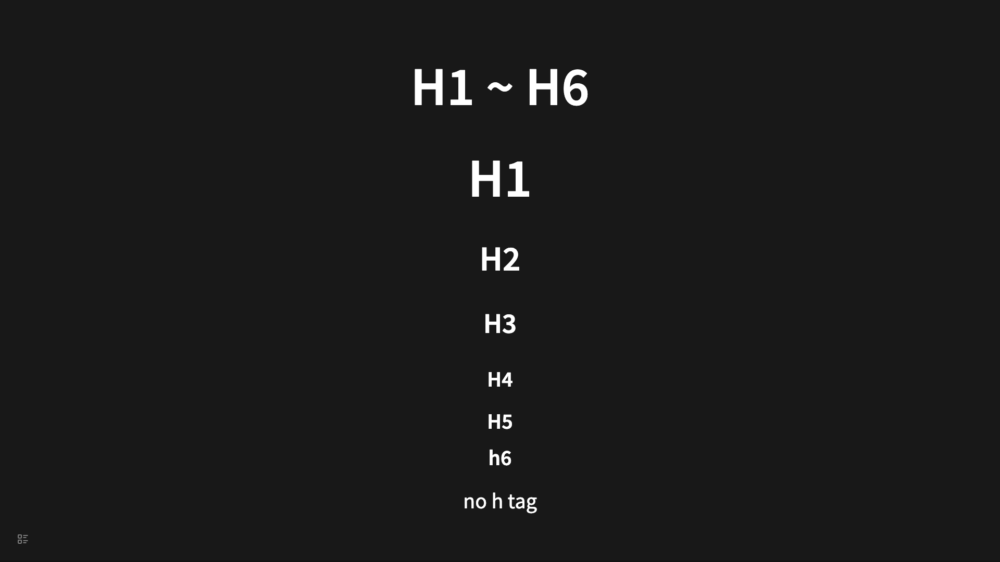
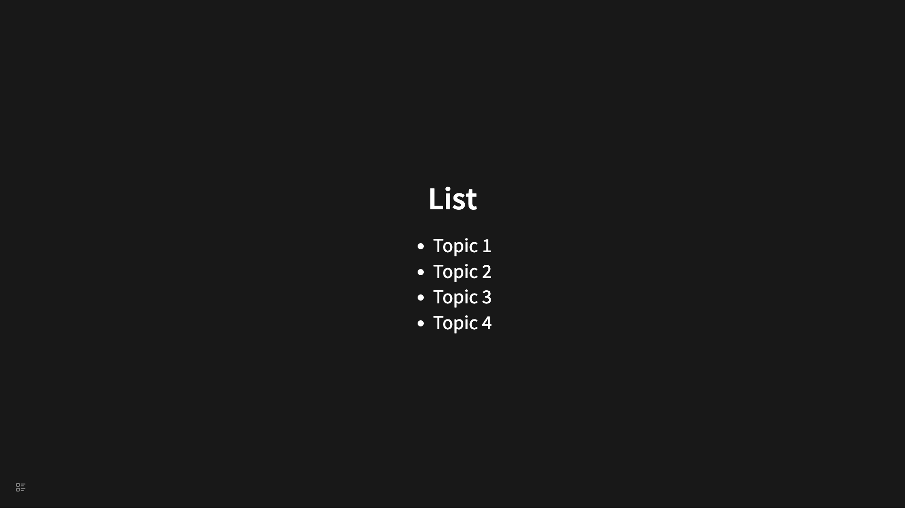
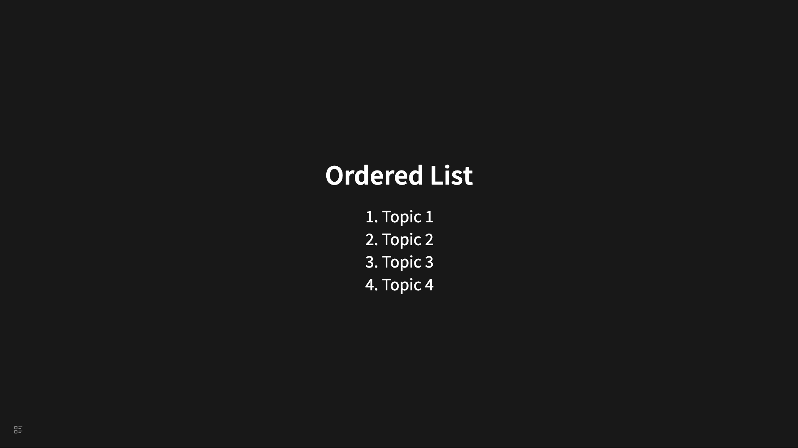
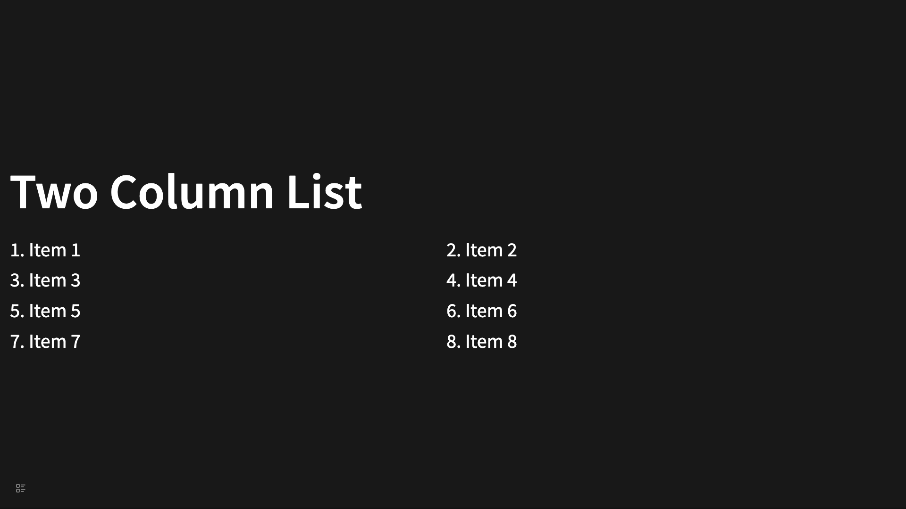
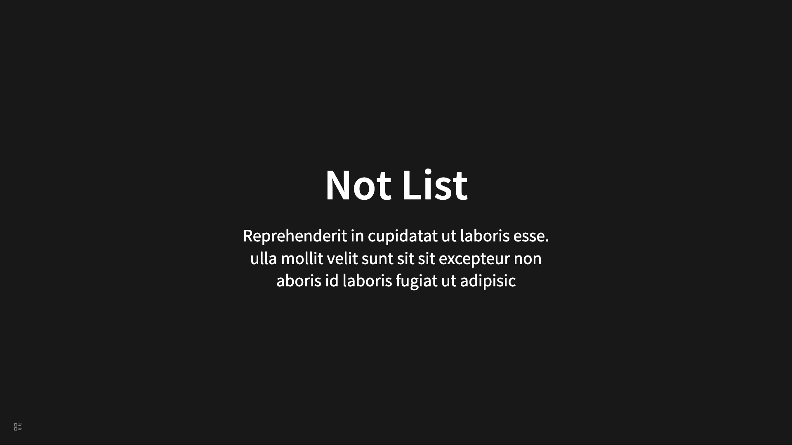
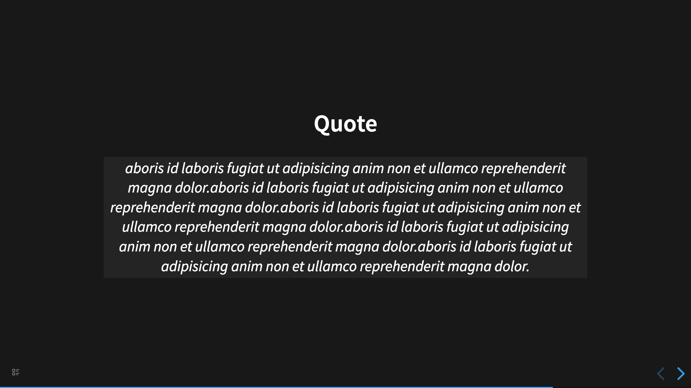

# 基础用法示例代码

## 不同的字体大小

```
- # H1 ~ H6
	- # H1
	- ## H2
	- ### H3
	- #### H4
	- ##### h5
	- ###### h6
	- no h tag
```



## 无序列表

```
- ## List
  data-list:: true
	- Topic 1
	- Topic 2
	- Topic 3
	- Topic 4
```



## 有序列表

```
- ## Ordered List
  data-ordered-list:: true
	- Topic 1
	- Topic 2
	- Topic 3
	- Topic 4
```



## 两列列表

```
- # Two Column List
  data-class:: !text-left
  data-two-column:: true
  data-ordered-list:: true
	- Item 1
	- Item 2
	- Item 3
	- Item 4
	- Item 5
	- Item 6
	- Item 7
	- Item 8
```



## 另一种两列列表

```
- # Another Two Column List
  data-list-class:: !grid !grid-cols-2 !gap-2 !w-full !px-4
  data-child-class:: !ml-4
  data-class:: !text-left
  data-list:: true
	- Item 1
	- Item 2
	- Item 3
	- Item 4
	- Item 5
	- Item 6
	- Item 7
	- Item 8
```


## 无列表

```
- # Not List
	- Reprehenderit in cupidatat ut laboris esse.
	- ulla mollit velit sunt sit sit excepteur non
	- aboris id laboris fugiat ut adipisic
```



## 链接跳转

```
- ## Slide Link To
  data-id:: aa
	- I'am aa, let's go to cc
	- [Go to cc](#/cc)
- ## Slide Link Back
  data-id:: cc
	- I'am cc, let's go back to aa
	- [Go back to aa](#/aa)
```

## 表格

```
- ## Table
	-
	  | Name | Age | Height |
	  |---|---|---|
	  | Leo | 39 | 39 |
	  | Sam | 39 | 39 |
	  | Lily | 39 | 39 |
	  | Bob | 39 | 39 |
```


## 引用

```
- ## Quote
	-
	  > aboris id laboris fugiat ut adipisicing anim non et ullamco reprehenderit magna dolor.aboris id laboris fugiat ut adipisicing anim non et ullamco reprehenderit magna dolor.aboris id laboris fugiat ut adipisicing anim non et ullamco reprehenderit magna dolor.aboris id laboris fugiat ut adipisicing anim non et ullamco reprehenderit magna dolor.aboris id laboris fugiat ut adipisicing anim non et ullamco reprehenderit magna dolor.
```



## 本地图片

```
- # Local Image
	- 
	- Support local image rendering.
```


## 本地视频

```
- # Local Video
	- 
```


## 隐藏幻灯片

```
- # Hidden Slide
  data-visibility:: hidden
```
