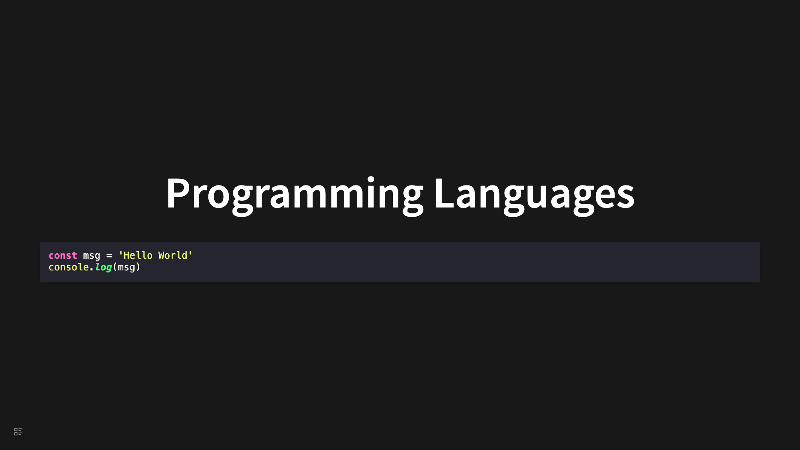
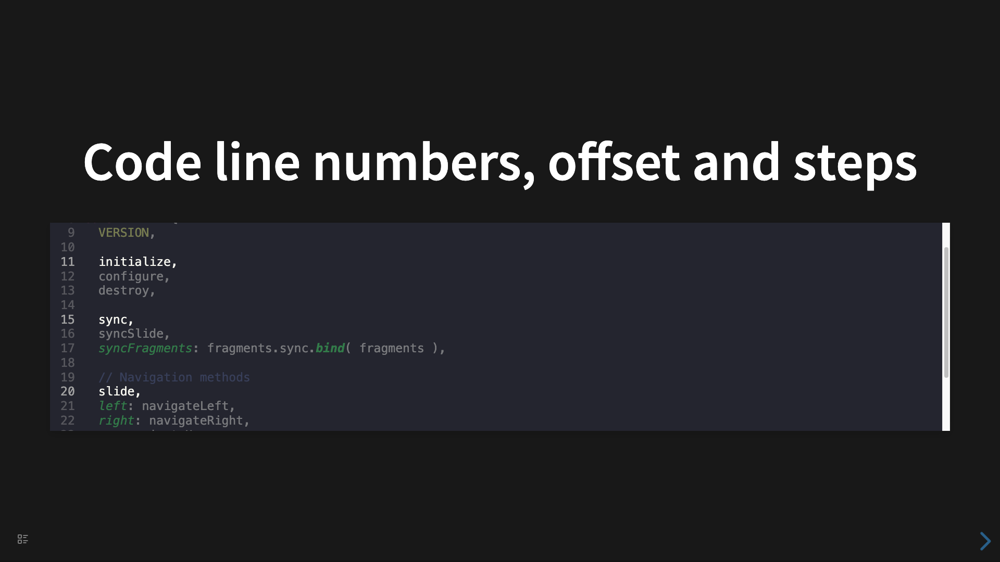

# 代码高亮

## 编程语言

````
```js
const msg = "Hello World";
console.log(msg);
```
````



## 代码行号，偏移，分步

````
```ts 7:5,9,14|6,10,15|7,11,16
// The public reveal.js API
const API = {
  VERSION,

  initialize,
  configure,
  destroy,

  sync,
  syncSlide,
  syncFragments: fragments.sync.bind(fragments),

  // Navigation methods
  slide,
  left: navigateLeft,
  right: navigateRight,
  up: navigateUp,
  down: navigateDown,
  prev: navigatePrev,
  next: navigateNext,
};
```
````


