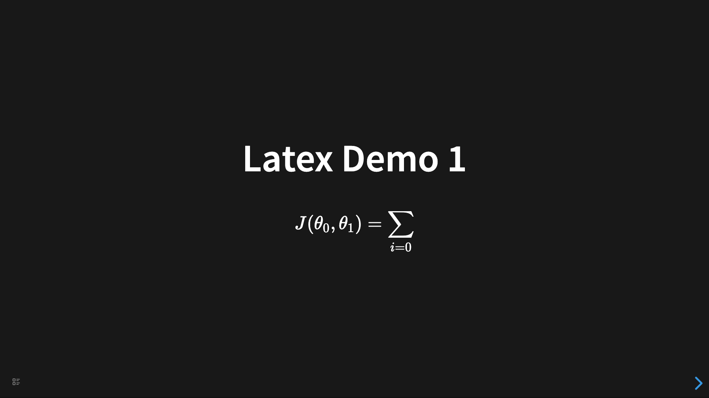
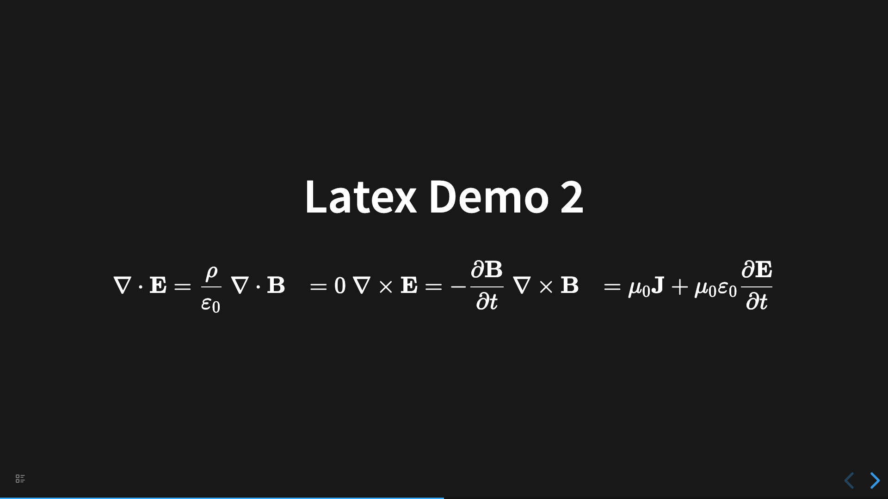
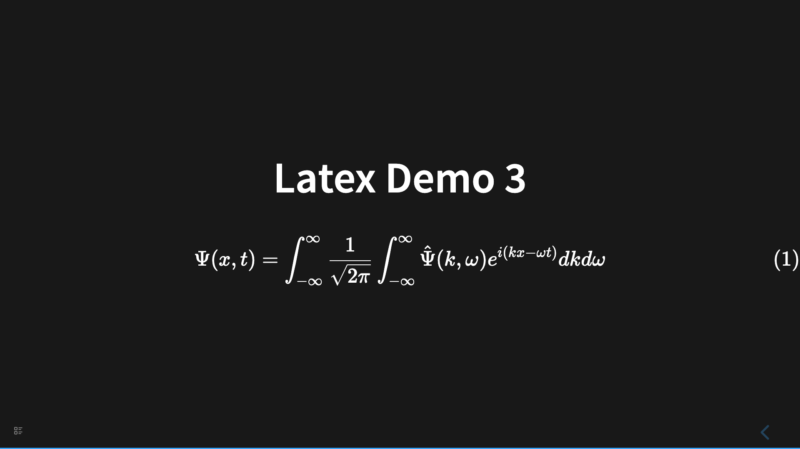

# Latex 公式

## 示例 1

```
- # Latex Demo 1
	-
$$ J(\theta_0,\theta_1) = \sum_{i=0} $$
```



## 示例 2

```
- # Latex Demo 2
  id:: 660aa819-834b-474c-b391-11b2e248c92d
	-
$$\begin{align*}
	      \nabla \cdot \mathbf{E} & = \frac{\rho}{\varepsilon_0} \\
	      \nabla \cdot \mathbf{B} & = 0 \\
	      \nabla \times \mathbf{E} & = -\frac{\partial \mathbf{B}}{\partial t} \\
	      \nabla \times \mathbf{B} & = \mu_0 \mathbf{J} + \mu_0\varepsilon_0 \frac{\partial \mathbf{E}}{\partial t}
	  \end{align*}$$
```



## 示例 3

```
- # Latex Demo 3
  id:: 660aa5c9-c7cd-4b5e-b21d-e3d19a2f5e40
	-
$$\begin{equation} \Psi(x, t) = \int_{-\infty}^{\infty} \frac{1}{\sqrt{2\pi}} \int_{-\infty}^{\infty} \hat{\Psi}(k, \omega) e^{i(kx - \omega t)} dk d\omega \end{equation}$$
```


