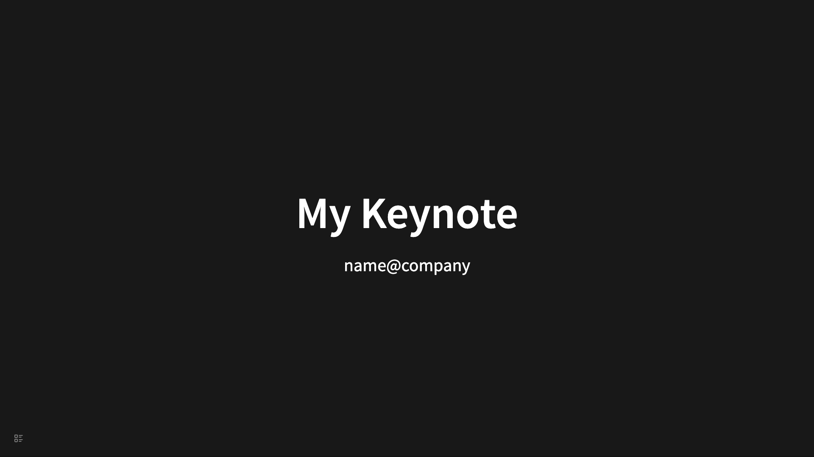

# 快速开始

欢迎安装并尝试使用 Logseq Slide Reveal。这是一个简单的说明，让你快速理解和开始使用。

## 是什么

Logseq Slide Reveal 是一个 Logseq 插件，它允许您在 Logseq 中创建基于 Reveal.js 幻灯片。和 Logseq 内置的幻灯片解决方案不同的是，不是每一个 Block 都转化为一页幻灯片，而是每个顶层 Block 加上下一级 Block 共同构成一页幻灯片。

另外，用此插件制作幻灯片的原则是你需要在你需要的地方设计你需要的幻灯片，而不是把你之前写好的每一个页面都转化成幻灯片。

## 特性

- 每个幻灯片页面由每个顶层 Block 加上下一级 Block 共同构成
- 插件提供了一些 Block 属性来控制幻灯片的样式
- 支持设置幻灯片主题
- 支持设置幻灯片切换过渡效果
- 支持画笔
- 支持快捷键
- 支持缩放
- 支持垂直导航幻灯片
- 支持只把某个 Block 的子元素转为幻灯片
- 支持预览单个幻灯片节点
- 还有更多

## 安装

### 插件市场

在插件市场中搜索它，并从那里进行安装。

### 手动安装

1. 从发布页面下载最新的 zip 文件。
2. 将 zip 文件解压缩到您想要存储插件的文件夹中。
3. 在 Logseq 中打开开发者模式。
4. 通过点击插件模态框上的“加载未打包插件”按钮，加载解压缩后的文件夹
5. 您现在应该能看到插件已经被安装。

## 快速开始

1. 创建一个新页面，像往常一样，添加第一个 Block

```
- # My Keynote
	- name@company
```

2. 页面的右上角有一个幻灯片的图标，点击它，你就可以查看你的幻灯片了。



3. 就是这样，你已经制作了你的第一个幻灯片了。

4. 接下来，你可以在页面上添加更多的 Block，然后点击右上角的幻灯片图标，就可以查看你的幻灯片了。你可能需要阅读更多文档内容来学习如果让你的幻灯片更酷。
