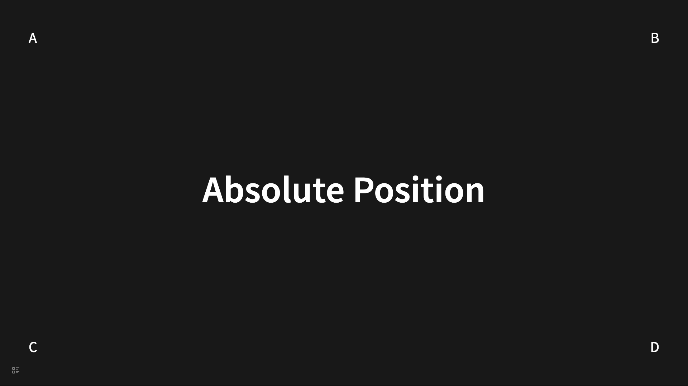
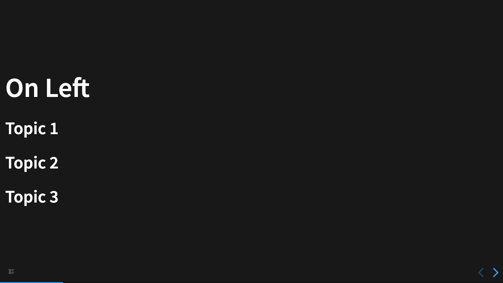
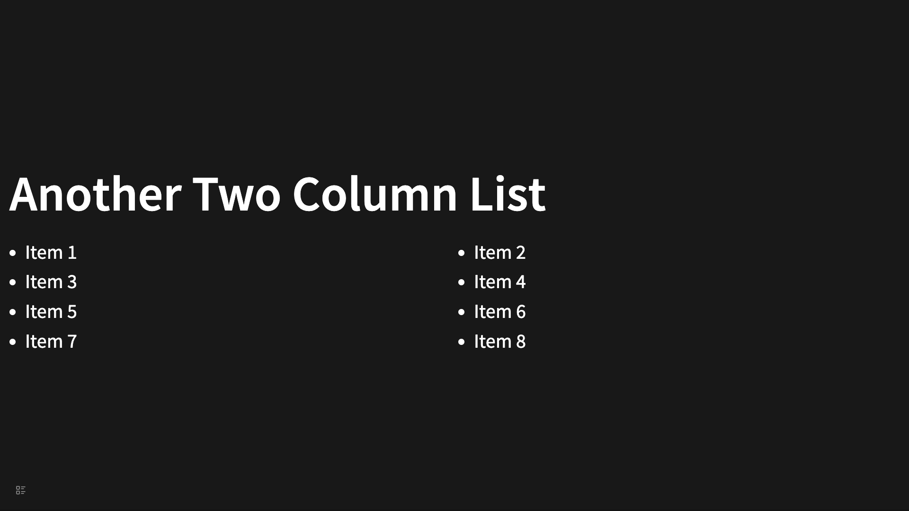

# 布局

默认幻灯片的布局是页面居中展示，这在大多数情况下是适用的，并且还默认支持了半屏背景和两栏布局等特殊布局。如果想要更灵活的布局，在本插件中需要了解一些 CSS 的知识和一些 Tailwind CSS 的知识。

## 绝对定位

这是一种常见的需求，就是希望指定的节点，显示在页面的任意位置上，这个需要使用绝对定位来实现。这是一种 CSS 技巧和配合 Tailwind CSS 的实现。例如：

```
- # Absolute Position
  data-section-class:: !relative
  data-child-class:: !w-fit !absolute
	- A
	  data-class:: !top-20 !left-20
	- B
	  data-class:: !top-20 !right-20
	- C
	  data-class:: !bottom-20 !left-20
	- D
	  data-class:: !bottom-20 !right-20
```

会被渲染成



## Flex 布局

Flex 布局是一种常见的布局方式，幻灯片每个 `<section>` 都是一个 `flex` 容器，因此我们比较容易的实现 Flex 布局。以居左为例：

```
- # On Left
  data-section-class:: !items-start
  data-child-class:: !text-left
  data-class:: !text-left
	- ## Topic 1
	- ## Topic 2
	- ## Topic 3
```

会被渲染成



那么猜猜下面的幻灯片是什么布局？

```
- # On Bottom Right
  data-section-class:: !justify-end !items-end
  data-child-class:: !text-right
  data-class:: !text-right
	- ## Topic 1
	- ## Topic 2
	- ## Topic 3
```

## 网格布局

网格布局不是默认原生支持的，但是借助 Tailwind CSS 的 类，是可以实现的。

```
- # Grid Layout
  data-class:: !absolute !left-1/2 !-translate-x-1/2
  data-section-class:: !grid !grid-cols-4 !gap-4
  data-child-class:: !bg-red-500 !rounded-md !text-gray-200 !w-40 !h-20 !mx-auto !flex !justify-center !items-center
	- 1
	- 2
	- 3
	- 4
	- 5
	- 6
	- 7
	- 8
	- 9
	- 10
	- 11
	- 12
```

会被渲染成


### 使用网格布局实现双栏布局

```
- # Another Two Column List
  data-list-class:: !grid !grid-cols-2 !gap-2 !w-full !px-4
  data-child-class:: !ml-4
  data-class:: !text-left
  data-list:: true
	- Item 1
	- Item 2
	- Item 3
	  collapsed:: true
	- Item 4
	- Item 5
	- Item 6
	- Item 7
	- Item 8
```


