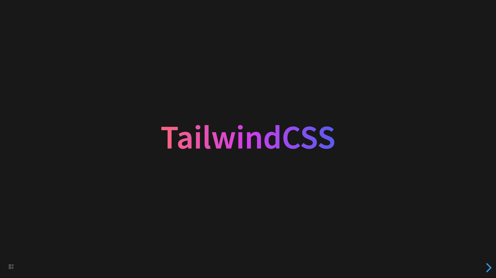

# Tailwind CSS

插件内置了大量的 Tailwind CSS 样式。需要注意的是:

::: warning

1. 支持大量而不是全部，这个支持范围后面会继续优化，去掉不常用的，加入常用的。
2. 所有的类名都以 `!` 开头，从而获得更高的优先级，使得希望的样式生效。
   :::

## 编译时使用的配置

```js
safelist: [
    "!bg-clip-border",
    "!bg-clip-padding",
    "!bg-clip-content",
    "!bg-clip-text",
    "!border",
    "!border-0",
    "!border-2",
    "!border-4",
    "!border-8",
    "!border-t",
    "!border-b",
    "!border-l",
    "!border-r",
    "!underline",
    "!line-through",
    "!uppercase",
    "!lowercase",
    "!capitalize",
    "!transition",
    "!border-solid",
    "!border-dashed",
    "!flex",
    "!block",
    "!inline",
    "!inline-block",
    "!float-left",
    "!float-right",
    "!absolute",
    "!relative",
    "!fixed",
    "!grid",
    "!justify-normal",
    "!justify-start",
    "!justify-end",
    "!justify-center",
    "!justify-between",
    "!justify-around",
    "!justify-evenly",
    "!justify-stretch",
    "!justify-items-start",
    "!justify-items-end",
    "!justify-items-center",
    "!justify-items-stretch",
    "!items-start",
    "!items-end",
    "!items-center",
    "!items-baseline",
    "!items-stretch",
    "!shadow-sm",
    "!shadow",
    "!shadow-md",
    "!shadow-lg",
    "!shadow-xl",
    "!shadow-2xl",
    "!shadow-inner",
    "!shadow-none",
    "!text-left",
    "!text-center",
    "!text-right",
    {
      pattern:
        /!border-([a-z]+)-((50|100|200|300|400|500|600|700|800|900)|(black|white|inherit|current|transparent))$/,
    },

    { pattern: /!w-(.*)/ },
    { pattern: /!h-(.*)/ },
    { pattern: /!(p|px|py|pl|pr|pt|pb|ps|pe)-([0-9]+|auto|px)$/ },
    // { pattern: /!-(p|px|py|pl|pr|pt|pb|ps|pe)-([0-9]+|auto|px)$/ },
    { pattern: /!(m|mx|my|ml|mr|mt|mb|ms|me)-([0-9]+|auto|px)$/ },
    { pattern: /!-(m|mx|my|ml|mr|mt|mb|ms|me)-([0-9]+|auto|px)$/ },
    { pattern: /!text-([a-z0-9]+)$/ },

    {
      pattern:
        /!text-([a-z]+)-((50|100|200|300|400|500|600|700|800|900)|(black|white|inherit|current|transparent))$/,
    },
    {
      pattern:
        /!shadow-([a-z]+)-((50|100|200|300|400|500|600|700|800|900)|(black|white|inherit|current|transparent))$/,
    },
    {
      pattern:
        /!bg-(([a-z]+)-(50|100|200|300|400|500|600|700|800|900)|(black|white|inherit|current|transparent)|gradient-(.*))$/,
    },
    {
      pattern:
        /!from-(([a-z]+)-(50|100|200|300|400|500|600|700|800|900)|(black|white))$/,
    },
    {
      pattern:
        /!via-(([a-z]+)-(50|100|200|300|400|500|600|700|800|900)|(black|white))$/,
    },
    {
      pattern:
        /!to-(([a-z]+)-(50|100|200|300|400|500|600|700|800|900)|(black|white))$/,
    },
    { pattern: /!font-(.*)/ },
    { pattern: /!duration-(.*)/ },
    { pattern: /!ease-(.*)/ },
    { pattern: /!scale-(.*)/, variants: ["hover"] },
    { pattern: /!translate-(.*)/ },
    { pattern: /!-translate-(.*)/ },
    { pattern: /!skew-(.*)/ },
    { pattern: /!origin-(.*)/ },
    { pattern: /!rotate-(.*)/ },
    { pattern: /!left-(.*)/ },
    { pattern: /!right-(.*)/ },
    { pattern: /!top-(.*)/ },
    { pattern: /!bottom-(.*)/ },
    { pattern: /!z-(.*)/ },
    { pattern: /!flex-(.*)/ },
    { pattern: /!content-(.*)/ },
    { pattern: /!grid-(.*)/ },
    { pattern: /!auto-(.*)/ },
    { pattern: /!row-(.*)/ },
    { pattern: /!col-(.*)/ },
    { pattern: /!gap-(.*)/ },
    {
      pattern: /!(rounded|rounded-md|rounded-lg|rounded-full)$/,
    },
  ],
```

## 例子

```
- TailwindCSS
  data-class:: !bg-gradient-to-r !from-rose-400 !via-fuchsia-500 !to-indigo-500 !text-transparent !bg-clip-text !w-auto !text-9xl !font-bold
```

将被渲染为


