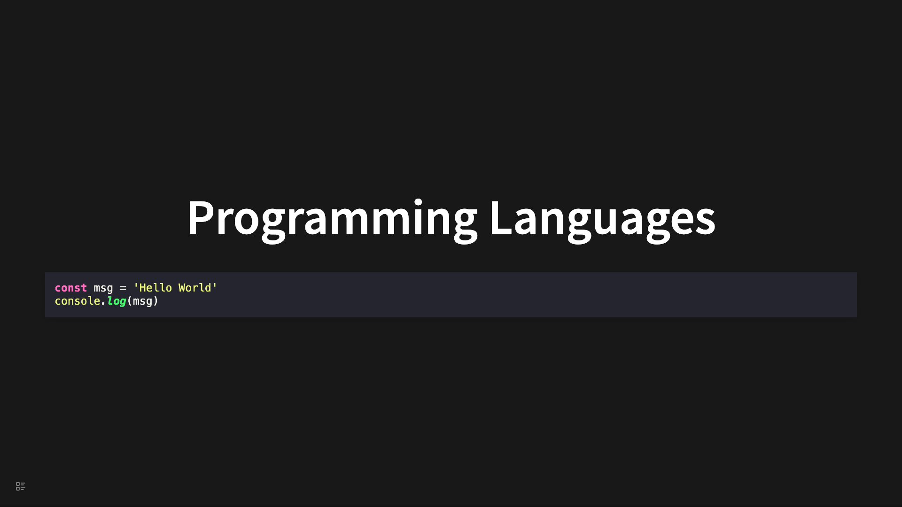

# Code & Highlight

## Programming Languages

<pre><code>```js
const msg = "Hello World";
console.log(msg);
```
</code></pre>



## Code line numbers, offset and steps

<pre><code>
```ts 7:5,9,14|6,10,15|7,11,16
// The public reveal.js API
const API = {
  VERSION,

  initialize,
  configure,
  destroy,

  sync,
  syncSlide,
  syncFragments: fragments.sync.bind(fragments),

  // Navigation methods
  slide,
  left: navigateLeft,
  right: navigateRight,
  up: navigateUp,
  down: navigateDown,
  prev: navigatePrev,
  next: navigateNext,
};
```
</code></pre>


