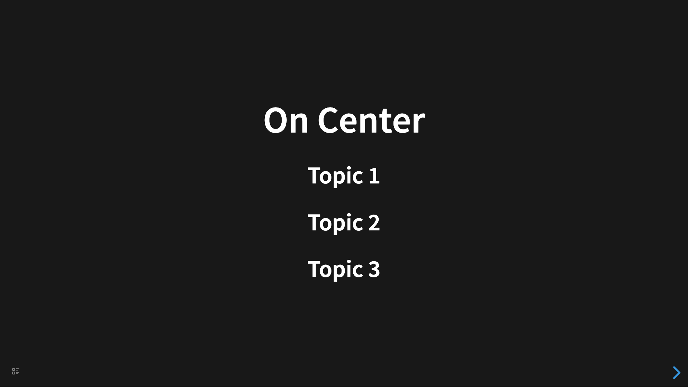
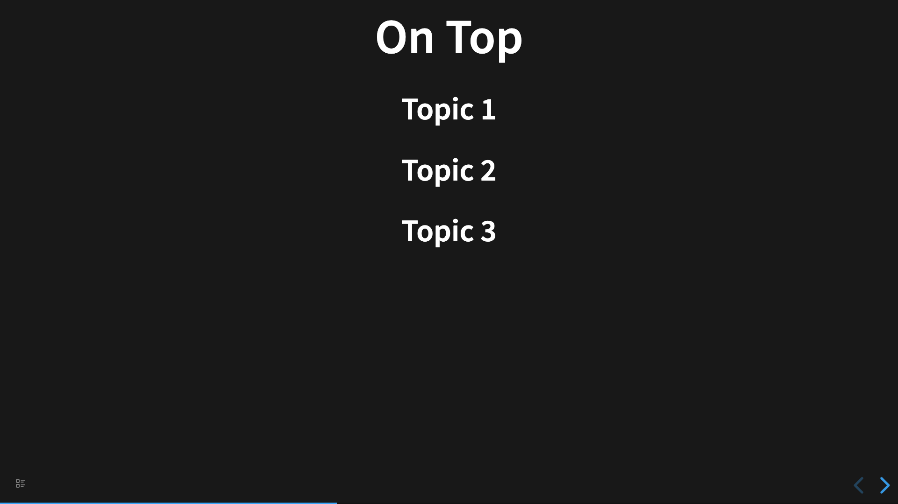

# Layout

You can set default layout on plugin settings. But you also can set `data-layout` property for specific slide.

## Center

```
- # On Center
	- ## Topic 1
	- ## Topic 2
	- ## Topic 3
```



## Left

```
- # On Left
  data-layout:: left
	- ## Topic 1
	- ## Topic 2
	- ## Topic 3
```


## Right

```
- # On Right
  data-layout:: right
	- ## Topic 1
	- ## Topic 2
	- ## Topic 3
```

## Top

```
- # On Top
  data-layout:: top
	- ## Topic 1
	- ## Topic 2
	- ## Topic 3
```



## Top Left

```
- # On Top Left
  data-layout:: top-left
	- ## Topic 1
	- ## Topic 2
	- ## Topic 3
```

## Top Right

```
- # On Top Right
  data-layout:: top-right
	- ## Topic 1
	- ## Topic 2
	- ## Topic 3
```

## Bottom

```
- # On Bottom
  data-layout:: bottom
	- ## Topic 1
	- ## Topic 2
	- ## Topic 3
```

## Bottom Left

```
- # On Bottom Left
  data-layout:: bottom-left
	- ## Topic 1
	- ## Topic 2
	- ## Topic 3
```

## Bottom Right

```
- # On Bottom Right
  data-layout:: bottom-right
	- ## Topic 1
	- ## Topic 2
	- ## Topic 3
```
