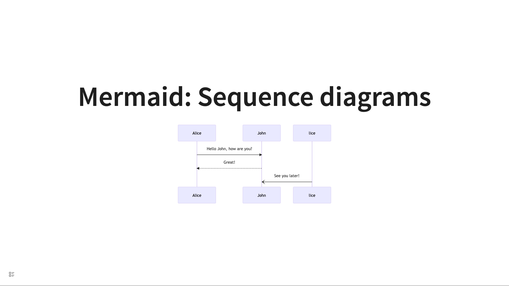
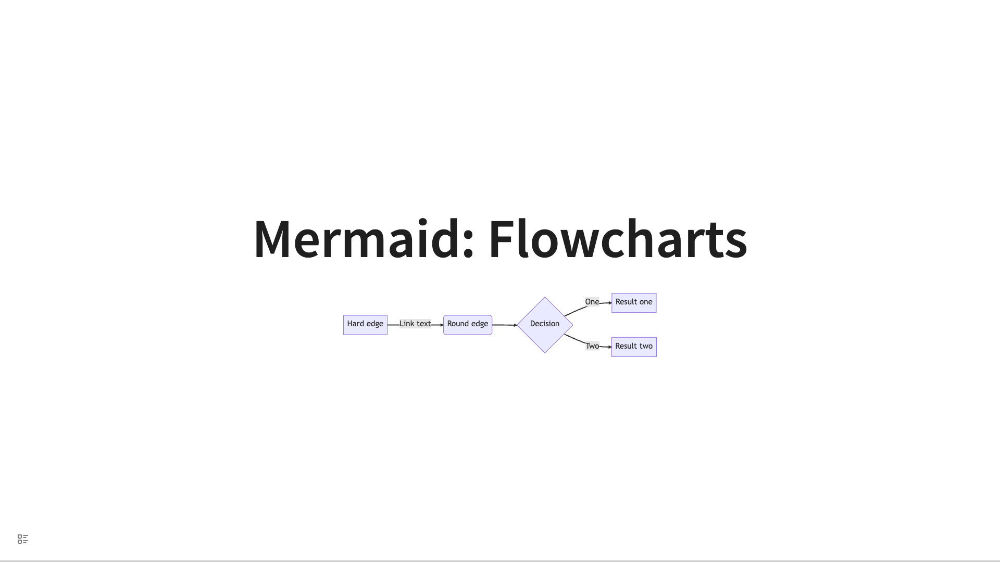

# Mermaid

Not all Mermaid diagrams are supported. Here are some examples. The following ones without images can be copied into your own Logseq to view.

## Sequence diagrams

````
- # Mermaid: Sequence diagrams
  data-theme:: white
	-
	  ```mermaid
	  sequenceDiagram
	      Alice->>John: Hello John, how are you?
	      John-->>Alice: Great!
	      lice-)John: See you later!

	  ```

````



## Flowcharts

````
- # Mermaid: Flowcharts
  id:: 660a9b3b-0fdd-4023-8fdd-ad6756c7d178
	-
	  ```mermaid
	  flowchart LR
	      A[Hard edge] -->|Link text| B(Round edge)
	      B --> C{Decision}
	      C -->|One| D[Result one]
	      C -->|Two| E[Result two]

	  ```
````



## State diagrams

````
- # Mermaid: State diagrams
  id:: 660a9c4e-3d02-45b7-8e50-e827f9ce4bfc
  collapsed:: true
	-
	  ```mermaid
	      stateDiagram-v2
	          State1: The state with a note
	          note right of State1
	              Important information! You can write
	              notes.
	          end note
	          State1 --> State2
	          note left of State2 : This is the note to the left.

	  ```

````

## Entity Relationship Diagrams

````
- # Mermaid: Entity Relationship Diagrams
  id:: 660a9cab-c28e-4341-8a89-2b571107065c
	-
	  ```mermaid
	  erDiagram
	      CAR ||--o{ NAMED-DRIVER : allows
	      CAR {
	          string registrationNumber PK
	          string make
	          string model
	          string[] parts
	      }
	      PERSON ||--o{ NAMED-DRIVER : is
	      PERSON {
	          string driversLicense PK "The license #"
	          string(99) firstName "Only 99 characters are allowed"
	          string lastName
	          string phone UK
	          int age
	      }
	      NAMED-DRIVER {
	          string carRegistrationNumber PK, FK
	          string driverLicence PK, FK
	      }
	      MANUFACTURER only one to zero or more CAR : makes

	  ```
````

## User Journey Diagram

````
- # Mermaid: User Journey Diagram
  id:: 660a9ccb-f3e4-409e-8edf-0fe44f35f1f1
	-
	  ```mermaid
	  journey
	      title My working day
	      section Go to work
	        Make tea: 5: Me
	        Go upstairs: 3: Me
	        Do work: 1: Me, Cat
	      section Go home
	        Go downstairs: 5: Me
	        Sit down: 5: Me

	  ```

````

## Gantt diagrams

````
- # Mermaid: Gantt diagrams
  id:: 660a9d42-480e-4441-b8cc-f47482383634
	-
	  ```mermaid
	  gantt
	      dateFormat  YYYY-MM-DD
	      title       Adding GANTT diagram functionality to mermaid
	      excludes    weekends
	      %% (`excludes` accepts specific dates in YYYY-MM-DD format, days of the week ("sunday") or "weekends", but not the word "weekdays".)

	      section A section
	      Completed task            :done,    des1, 2014-01-06,2014-01-08
	      Active task               :active,  des2, 2014-01-09, 3d
	      Future task               :         des3, after des2, 5d
	      Future task2              :         des4, after des3, 5d

	      section Critical tasks
	      Completed task in the critical line :crit, done, 2014-01-06,24h
	      Implement parser and jison          :crit, done, after des1, 2d
	      Create tests for parser             :crit, active, 3d
	      Future task in critical line        :crit, 5d
	      Create tests for renderer           :2d
	      Add to mermaid                      :until isadded
	      Functionality added                 :milestone, isadded, 2014-01-25, 0d

	      section Documentation
	      Describe gantt syntax               :active, a1, after des1, 3d
	      Add gantt diagram to demo page      :after a1  , 20h
	      Add another diagram to demo page    :doc1, after a1  , 48h

	      section Last section
	      Describe gantt syntax               :after doc1, 3d
	      Add gantt diagram to demo page      :20h
	      Add another diagram to demo page    :48h

	  ```
````

## Pie chart diagrams

````
- # Mermaid: Pie chart diagrams
  id:: 660a9d69-8b6d-4324-b778-66b7576d1e4e
	-
	  ```mermaid
	  %%{init: {"pie": {"textPosition": 0.5}, "themeVariables": {"pieOuterStrokeWidth": "5px"}} }%%
	  pie showData
	      title Key elements in Product X
	      "Calcium" : 42.96
	      "Potassium" : 50.05
	      "Magnesium" : 10.01
	      "Iron" :  5

	  ```
````

## Requirement Diagram

````
- # Mermaid: Requirement Diagram
  id:: 660a9dea-8492-4598-b140-17e624bac619
	-
	  ```mermaid
	          requirementDiagram

	      requirement test_req {
	      id: 1
	      text: the test text.
	      risk: high
	      verifymethod: test
	      }

	      element test_entity {
	      type: simulation
	      }

	      test_entity - satisfies -> test_req


	  ```
````

## Git Graph

````
- # Mermaid: Git Graph
  id:: 660a9e98-2dcb-4710-8c20-42ea6de733bd
  collapsed:: true
	-
	  ```mermaid
	  %%{init: { 'logLevel': 'debug', 'theme': 'base', 'gitGraph': {'rotateCommitLabel': true}} }%%
	  gitGraph
	    commit id: "feat(api): ..."
	    commit id: "a"
	    commit id: "b"
	    commit id: "fix(client): .extra long label.."
	    branch c2
	    commit id: "feat(modules): ..."
	    commit id: "test(client): ..."
	    checkout main
	    commit id: "fix(api): ..."
	    commit id: "ci: ..."
	    branch b1
	    commit
	    branch b2
	    commit

	  ```
````

## Not supported for now

- Quadrant Chart
- Zenuml
- Mindmap
- Timeline
- Sankey
- Xychart
- Block Diagrams
- Class diagrams
