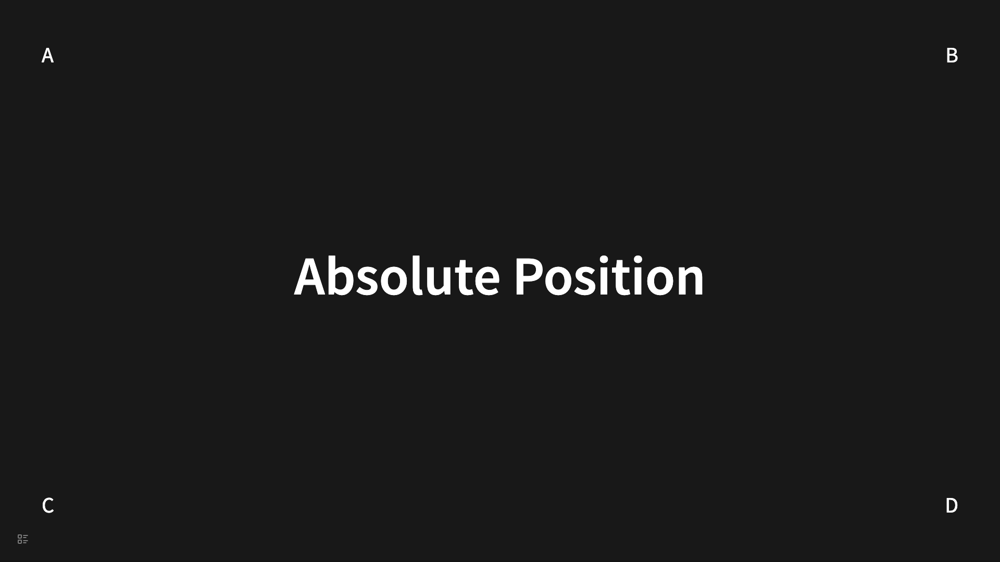
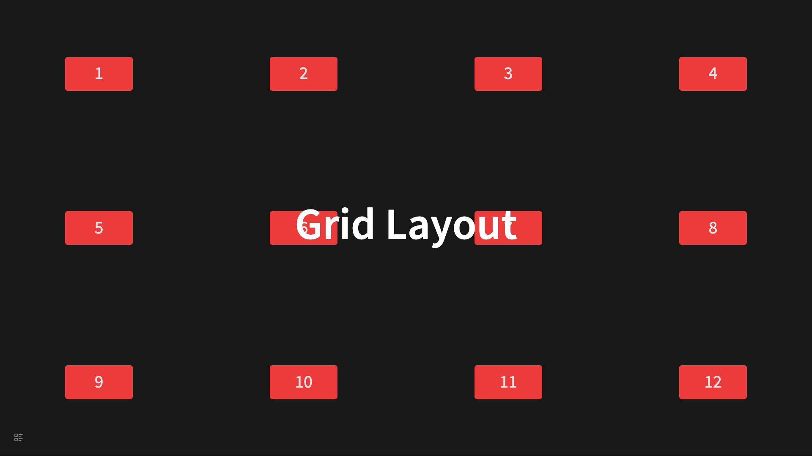
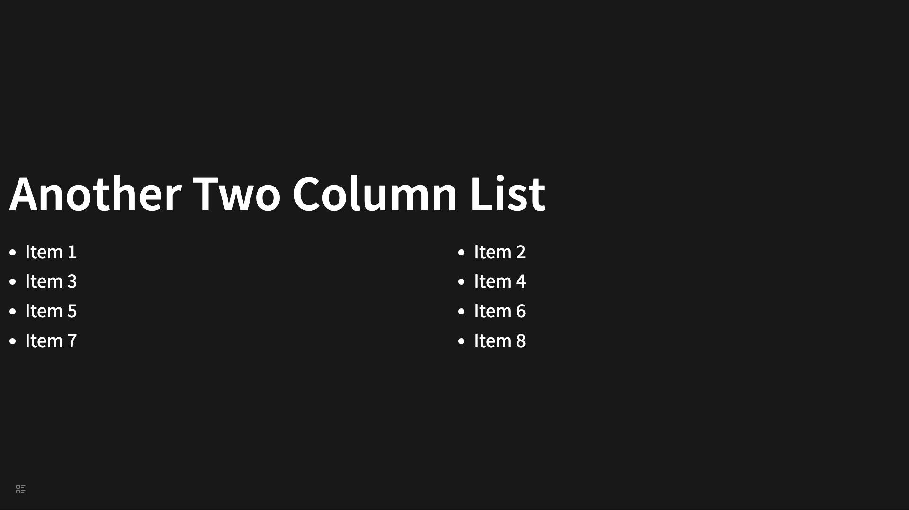

# Layout

The default layout for slides is a centered presentation on the page, which is suitable for most cases and natively supports special layouts such as semi-backgrounds and dual-column arrangements. For more flexible layouts, some knowledge of CSS and Tailwind CSS is required within this plugin.

## Absolute Positioning

A common requirement is to have a specific node displayed at any arbitrary position on the page. This is achieved through the use of absolute positioning, which involves a CSS technique combined with implementation using Tailwind CSS. For example:

```
- # Absolute Position
  data-section-class:: !relative
  data-child-class:: !w-fit !absolute
	- A
	  data-class:: !top-20 !left-20
	- B
	  data-class:: !top-20 !right-20
	- C
	  data-class:: !bottom-20 !left-20
	- D
	  data-class:: !bottom-20 !right-20
```

It will be rendered as:



## Flex Layout

Flex layout is a prevalent approach to organizing content, and each `<section>` in the slides constitutes a flex container, making it relatively straightforward to implement Flex-based arrangements. Consider the case of left alignment:

```
- # On Left
  data-section-class:: !items-start
  data-child-class:: !text-left
  data-class:: !text-left
	- ## Topic 1
	- ## Topic 2
	- ## Topic 3
```

It will be rendered as:


Guess what the layout of the following slide is?

```
- # On Bottom Right
  data-section-class:: !justify-end !items-end
  data-child-class:: !text-right
  data-class:: !text-right
	- ## Topic 1
	- ## Topic 2
	- ## Topic 3
```

## Grid Layout

Grid layout is not native to the plugin, but can be achieved through Tailwind CSS classes.

```
- # Grid Layout
  data-class:: !absolute !left-1/2 !-translate-x-1/2
  data-section-class:: !grid !grid-cols-4 !gap-4
  data-child-class:: !bg-red-500 !rounded-md !text-gray-200 !w-40 !h-20 !mx-auto !flex !justify-center !items-center
	- 1
	- 2
	- 3
	- 4
	- 5
	- 6
	- 7
	- 8
	- 9
	- 10
	- 11
	- 12
```

It will be rendered as:



### Implementing a Two-Column Layout with Grid

```
- # Another Two Column List
  data-list-class:: !grid !grid-cols-2 !gap-2 !w-full !px-4
  data-child-class:: !ml-4
  data-class:: !text-left
  data-list:: true
	- Item 1
	- Item 2
	- Item 3
	  collapsed:: true
	- Item 4
	- Item 5
	- Item 6
	- Item 7
	- Item 8
```


