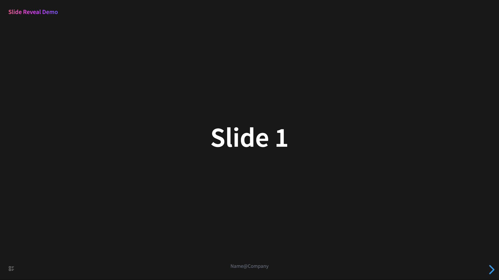

# Block Properties

Block properties are an essential component in Logseq. The Slide Reveal plugin extensively utilizes this concept to customize slides. There are various supported properties, each with different target objectives and scopes. Let's classify and introduce them one by one.

Below, you can see that some properties have values, while others are of type Bool. If there's no value, it should be written as `true`, indicating the application of that property.

## Set Theme

```
data-theme:: black
```

Supported themes:

- black
- moon
- white
- night
- league
- beige
- serif
- simple
- dracula
- sky
- blood
- solarized

We can set the theme in the plugin settings, but setting it with properties takes precedence. Additionally, these properties only apply to individual pages, and when flipping to the next page, the theme will revert to the theme set in the plugin settings. If the theme set in the plugin settings is `inherit`, indicating inheritance from the previous theme, it will maintain the theme set by the previous page's theme property.

## Set Code Theme

```
data-code-theme:: github
```

There are several code themes in the plugin. You can set it by the property or use the default theme in the plugin settings.

Supported themes:

- atom-one-light
- atom-one-dark
- github
- github-dark
- xcode
- idea
- monokai
- nord
- stackoverflow-light
- stackoverflow-dark
- androidstudio
- base16-material
- base16-dracula
- hybrid
- docco
- far

## Set Transition Effects

Transition effects refer to the animation effects when flipping pages. They are divided into controlling the main text and background of the page separately.

```
data-transition:: slide
data-background-transition:: slide
```

The optional values are as follows:

- none
- fade
- slide
- convex
- concave
- zoom

## Lists

This differs from lists implemented based on Markdown, although visually similar.

### Unordered List

```
- ## List
  data-list:: true
	- Topic 1
	- Topic 2
	- Topic 3
	- Topic 4
```

### Ordered List

```
- ## Ordered List
  data-ordered-list:: true
	- Topic 1
	- Topic 2
	- Topic 3
	- Topic 4
```

### Two-column Layout

```
- # Two Column List
  data-two-column:: true
	- Item 1
	- Item 2
	- Item 3
	- Item 4
	- Item 5
	- Item 6
	- Item 7
	- Item 8
```

This property can also be used in conjunction with other properties.

## Set ID

The main purpose is to achieve link jump. Another use is to identify the same elements across different slides in animation effects.。

```
- ## Slide Link To
  data-id:: aa
	- I'am aa, let's go to cc
	- [Go to cc](#/cc)
- ## Slide Link Back
  data-id:: cc
	- I'am cc, let's go back to aa
	- [Go back to aa](#/aa)
```

## Auto Animation

Animation is a rather complex concept, and here we'll only introduce the most commonly used type.

```
- ## Auto Animation
  data-auto-animate:: true
	- ## A
	- ## B
	  collapsed:: true
	- ## C
	  collapsed:: true
	- ## D
- ## Auto Animation
  data-auto-animate:: true
	- ## B
	- ## D
	- ## A
	- ## C
```

Some other properties can also be used in conjunction.

| Attribute                   | Default  | Description                                                                                                                              |
| --------------------------- | -------- | ---------------------------------------------------------------------------------------------------------------------------------------- |
| data-auto-animate-easing    | ease     | A CSS [easing function](https://developer.mozilla.org/en-US/docs/Web/CSS/easing-function).                                               |
| data-auto-animate-unmatched | true     | Determines whether elements with no matching auto-animate target should fade in. Set to false to make them appear instantly.             |
| data-auto-animate-duration  | 1.0      | Animation duration in seconds.                                                                                                           |
| data-auto-animate-delay     | 0        | Animation delay in seconds (can only be set for specific elements, not at the slide level).                                              |
| data-auto-animate-id        | _absent_ | An [id](https://revealjs.com/auto-animate/#auto-animate-id-%26-restart) tying auto-animate slides together.                              |
| data-auto-animate-restart   | _absent_ | [Breaks apart](https://revealjs.com/auto-animate/#auto-animate-id-%26-restart) two adjacent auto-animate slides (even with the same id). |

More detailed information can be found in [Reveal.js](https://revealjs.com/auto-animate/)。

## Vertical Slides

:::tip
This is a feature for Pro users.
:::

Vertical slides is a core feature in Reveal.js. It's also supported in slide reveal plugin.

```
- Slide 2, `Vertical Mode will not render this block`
  data-vertical:: true
	- Vertical 1
		- a
		- b
		- c
	- Vertical 2
		- d
		- e
		- f
```

You can combine with other horizontal slides to form a grid-style slide.

## Background

There are types of background as follows.

### Colorful Background

```
- # Colorful Background
  data-background-color:: aquamarine
```

Here, color names can be referenced from [this document](https://developer.mozilla.org/en-US/docs/Web/CSS/named-color). If you're familiar with frontend technologies, you can also use other valid color formats, such as `#fff`, `rgb(255, 255, 255)`, `rgba(255, 255, 255, 0.5)`, etc.

### Gradient Background

```
- # Gradient Background
  data-background-gradient:: linear-gradient(217deg, rgba(255,0,0,.8), rgba(255,0,0,0) 70.71%), linear-gradient(127deg, rgba(0,255,0,.8), rgba(0,255,0,0) 70.71%), linear-gradient(336deg, rgba(0,0,255,.8), rgba(0,0,255,0) 70.71%)
```

The gradient rules here can be referenced from [this document](https://developer.mozilla.org/en-US/docs/Web/CSS/gradient/linear-gradient) and [this document](https://developer.mozilla.org/en-US/docs/Web/CSS/gradient/radial-gradient).

### Image Background

```
- # Image Background
  data-background-image:: https://source.unsplash.com/random?1
  data-background-opacity:: 0.5
```

| Attribute                | Default   | Description                                                                                       |
| ------------------------ | --------- | ------------------------------------------------------------------------------------------------- |
| data-background-image    |           | URL of the image to show. GIFs restart when the slide opens.                                      |
| data-background-size     | cover     | See [background-size](https://developer.mozilla.org/docs/Web/CSS/background-size) on MDN.         |
| data-background-position | center    | See [background-position](https://developer.mozilla.org/docs/Web/CSS/background-position) on MDN. |
| data-background-repeat   | no-repeat | See [background-repeat](https://developer.mozilla.org/docs/Web/CSS/background-repeat) on MDN.     |
| data-background-opacity  | 1         | Opacity of the background image on a 0-1 scale. 0 is transparent and 1 is fully opaque.           |

### Half background

```
- ## Half background to right
  data-list:: true
  data-half-background-to:: right
  data-half-background-image:: https://source.unsplash.com/random?2
	- ### I'm on the left
	- ### I'm on the left
	  collapsed:: true
	- ### I'm on the left
```

It also supports images on the left and text on the right.

### Video Background

```
- # Remote Video Background
  data-background-video:: `https://static.slid.es/site/homepage/v1/homepage-video-editor.mp4`
  data-background-video-loop:: true
  data-background-video-muted:: true
  data-background-opacity:: 0.5
```

| Attribute                   | Default | Description                                                                             |
| --------------------------- | ------- | --------------------------------------------------------------------------------------- |
| data-background-video       |         | A single video source, or a comma separated list of video sources.                      |
| data-background-video-loop  | false   | Flags if the video should play repeatedly.                                              |
| data-background-video-muted | false   | Flags if the audio should be muted.                                                     |
| data-background-size        | cover   | Use `cover` for full screen and some cropping or `contain` for letterboxing.            |
| data-background-opacity     | 1       | Opacity of the background video on a 0-1 scale. 0 is transparent and 1 is fully opaque. |

### Iframe Background

```
- # Youtube Background
  data-background-iframe:: https://www.youtube.com/embed/anmuklFtu8U?si=j9wRINS3buG3ZN2n
  data-background-interactive:: true
  data-preload:: true
  data-background-opacity:: 0.5
```

| Attribute                   | Default | Description                                                                                                                                     |
| --------------------------- | ------- | ----------------------------------------------------------------------------------------------------------------------------------------------- |
| data-background-iframe      |         | URL of the iframe to load                                                                                                                       |
| data-background-interactive | false   | Include this attribute to make it possible to interact with the iframe contents. Enabling this will prevent interaction with the slide content. |

## Style Control

### Based on CSS

Here, familiarity with CSS style syntax is required. Several properties are supported, each with different effects and scopes:

- `data-style`: Applies only to the current block.
- `data-child-style`: Applies to all immediate child blocks of the current block.
- `data-section-style`: Applies to the outermost tag of the current slide.
- `data-list-style`: Applies to list tags, used in conjunction with `data-list`.

### Based on `Tailwind CSS`

The plugin has built-in a vast array of Tailwind CSS styles, so it supports setting CSS class names.

- `data-class`: Applies only to the current block.
- `data-child-class`: Applies to all immediate child blocks of the current block.
- `data-section-class`: Applies to the outermost tag of the current slide.
- `data-list-class`: Applies to list tags, used in conjunction with `data-list`.

It's important to note that all Tailwind CSS class names start with `!` to increase the specificity of the styles.

## Common header and footer

```
data-header:: true
```

或

```
data-footer:: true
```

Blocks identified as common headers and footers will not be treated as content for the current slide but will appear on every slide. To meet specific requirements, they need to be combined with other properties for positioning and styling.

For example:

```
- Slide Reveal Demo
  data-header:: true
  data-class:: !absolute !top-0 !left-0 !text-left !p-8 !font-bold  !text-2xl !bg-gradient-to-r !from-rose-400 !via-fuchsia-500 !to-indigo-500 !text-transparent  !bg-clip-text !w-auto
- Name@Company
  data-footer:: true
  data-class:: !absolute !bottom-8 !text-center !p-2 !w-full !text-xl !text-gray-500
- # Slide 1
```

It will look like this:



## Fragments

To enable one slide to be divided into multiple fragments, each fragment being displayed sequentially, you can achieve variations through attribute settings.

- `data-fragment`: Sets the fragment effect for the current block.
- `data-child-fragment`: Sets the fragment effect for all immediate child blocks of the current block.
- `data-fragment-index`: Sets the fragment index for the current block.

Fragment effects can include the following options:

| Name                    | Effect                                              |
| ----------------------- | --------------------------------------------------- |
| fade-out                | Start visible, fade out                             |
| fade-up                 | Slide up while fading in                            |
| fade-down               | Slide down while fading in                          |
| fade-left               | Slide left while fading in                          |
| fade-right              | Slide right while fading in                         |
| fade-in-then-out        | Fades in, then out on the next step                 |
| current-visible         | Fades in, then out on the next step                 |
| fade-in-then-semi-out   | Fades in, then to 50% on the next step              |
| grow                    | Scale up                                            |
| semi-fade-out           | Fade out to 50%                                     |
| shrink                  | Scale down                                          |
| strike                  | Strike through                                      |
| highlight-red           | Turn text red                                       |
| highlight-green         | Turn text green                                     |
| highlight-blue          | Turn text blue                                      |
| highlight-current-red   | Turn text red, then back to original on next step   |
| highlight-current-green | Turn text green, then back to original on next step |
| highlight-current-blue  | Turn text blue, then back to original on next step  |

## Layout

You can set default layout on plugin settings. But you also can set `data-layout` property for specific slide.

Support 9 layouts:

- center
- left
- right
- top
- bottom
- top-left
- top-right
- bottom-left
- bottom-right

## Hide slide

```
data-visibility:: hidden
```

It will not be rendered if this attribute is marked

## Magic page level properties

Most of the properties can be set on page level by adding `page-` prefix to the property name, e.g. `data-page-layout:: left`. You can use this way to give each slide common properties.

Some properties are not supported on page level or meaningless.

- `data-header`
- `data-footer`
- `data-id`
- `data-fragment-index`
